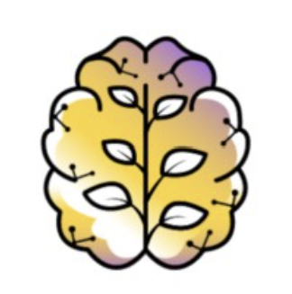

# Young Neuromorphs

  

A collaborative space for researchers, engineers, and curious minds sharing knowledge for the future of neuromorphic computing and brain-inspired technologies.

---

## Members Backgrounds

---

## Our Community

  

-  💡 We believe in sharing knowledge, collaborating across disciplines, and growing together.
-  📚 We will upload materials and resources for learning, collaboration and community building soon.
-  🙋‍♂️ Whether you're a student, researcher, or enthusiast—you're welcome here.

---

### Join the Movement

Get involved and stay updated through our links:

 
   

---

  

---
